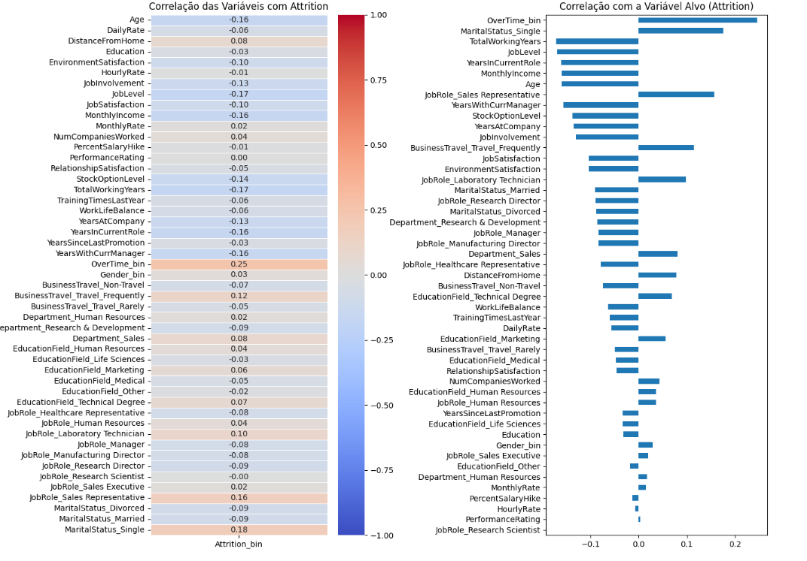

# _People_ _Analytics_ _and_ _Employee_ _Turnover_ _Prediction_
## Identificação da Equipa
* **Grupo nº:** 10
* **Membros:**
* Luís Figueira - 2022160309 (a2022160309@alumni.iscac.pt)
* Martim Ferreira - 2023132459 (a2023132459@alumni.iscac.pt)
* Mateus Afonso - 2023142275 (a2023142275@alumni.iscac.pt)
## Organização do Repositório
A estrutura deste projeto segue as boas práticas de Ciência de Dados e Engenharia de _Software_:
* **`data/`**: Armazenamento de dados (dados brutos em `raw/` e processados em `processed/`).
* **`docs/`**: Documentação técnica detalhada dividida por _Milestones_ (M1, M2, M3 e M4).
* **`notebooks/`**: _Jupyter_ _Notebooks_ para experimentação, limpeza e modelação.
* **`reports/`**: Relatórios finais, apresentações e exportação de figuras (`figures/`).
* **`src/`**: Código-fonte modular (scripts `.py`) para funções reutilizáveis.
* **`requirements.txt`**: Ficheiro de configuração com as bibliotecas necessárias.
## 1. Iniciação (_Milestone_ 1)

Este projeto aplica metodologias de Ciência de Dados ao problema da rotatividade de colaboradores (_Employee_ _Attrition_) no contexto de _HR_ _Analytics_. A retenção de talento constitui um desafio estratégico para organizações modernas, com impacto direto nos custos operacionais, produtividade e sustentabilidade organizacional.

Com base no dataset _IBM HR Analytics Employee Attrition & Performance_ (1470 colaboradores, 35 variáveis), o objetivo consiste em analisar os fatores associados ao atrito (`Attrition`) e desenvolver modelos preditivos capazes de estimar o risco de saída de colaboradores.

O projeto segue a metodologia CRISP-DM e encontra-se estruturado em quatro _milestones_: iniciação, exploração, modelação e finalização.

### Objetivos do Projeto (_SMART_)
* **Objetivo 1:** Desenvolver um modelo de classificação para prever o atrito (`Attrition`), alcançando um _F1-Score_ mínimo de 0,80 em validação cruzada estratificada (k=15), até ao dia 23/04/2026 (_Milestone 3_).
* **Objetivo 2:** Aplicar técnicas de _clustering_ para identificar e caracterizar perfis distintos de colaboradores com base nas variáveis relevantes do _dataset_, determinando o número ótimo de agrupamentos (_clusters_) através do método do cotovelo e do _Silhouette_ _Score_, garantindo um valor médio de _Silhouette_ superior a 0,50, e descrevendo estatisticamente cada perfil identificado, até ao dia 23/04/2026.
### Perguntas de Investigação

As perguntas de investigação estruturam o enquadramento científico do estudo, orientando a análise empírica dos dados com o objetivo de identificar os principais determinantes do atrito (`Attrition`), avaliar a sua relevância estatística e preditiva e verificar a viabilidade de desenvolver modelos capazes de prever este fenómeno de forma fiável.

**1.** Quais são as variáveis com maior poder explicativo e preditivo do atrito (`Attrition`) dos colaboradores?

**2.** Existe uma associação estatisticamente significativa entre a realização de horas extraordinárias (`OverTime`) e a probabilidade de atrito (`Attrition`)?

**3.** O nível de satisfação no trabalho (`JobSatisfaction`) e o equilíbrio entre vida pessoal e profissional (`WorkLifeBalance`) influenciam significativamente o risco de atrito (`Attrition`)?

**4.** O rendimento mensal (`MonthlyIncome`) tem impacto significativo na probabilidade de atrito (`Attrition`), mesmo após controlo multivariável?

**5.** Qual dos algoritmos de classificação testados apresenta melhor desempenho e maior estabilidade na previsão do atrito (`Attrition`)?

**6.** O desequilíbrio da variável alvo influencia o desempenho dos modelos preditivos e pode ser mitigado através da aplicação da técnica SMOTE?

**7.** É possível construir um índice de risco de atrito (`Attrition`) interpretável e fiável, baseado nas probabilidades previstas pelo modelo, que permita classificar os colaboradores em quatro categorias de risco (Baixo: prob < 30%, Médio: 30% ≤ prob < 50%, Alto: 50% ≤ prob < 70% e Crítico: prob ≥ 70%) e apoiar a tomada de decisão em contexto organizacional?

**8.** Que fatores distinguem os colaboradores com maior risco de atrito (`Attrition`) dos restantes, e como podem ser utilizados para apoiar estratégias de retenção?

## 2. Exploração (_Milestone_ 2)

### Limpeza e Preparação

Foi realizada uma análise da qualidade dos dados com o objetivo de garantir a consistência e fiabilidade do dataset antes da modelação.

* **Valores em falta:** Não foram identificados valores nulos, não sendo necessária a aplicação de técnicas de imputação ou remoção de observações.
* **_Outliers_:** Foram detetados valores extremos em várias variáveis numéricas através do método IQR. No entanto, estes valores foram considerados plausíveis no contexto organizacional, tendo-se optado por não remover observações, de forma a preservar a representatividade dos dados.
* **Consistência dos dados:** Foi validada a coerência entre variáveis relacionadas com experiência profissional e idade, não tendo sido identificadas inconsistências lógicas. A estrutura salarial revelou-se consistente com os níveis hierárquicos.
* **_Encoding_:** Codificação binária (0/1) aplicada a `Attrition`, `OverTime` e `Gender`; One-Hot Encoding aplicado a `BusinessTravel`, `Department`, `EducationField`, `JobRole` e `MaritalStatus`.
* **Escalonamento:** Adiado para a _Milestone_ 3, onde será integrado nas pipelines de cada modelo para evitar _data_ _leakage_.

De forma geral, o _dataset_ apresenta boa qualidade e consistência, permitindo avançar para as etapas de transformação e modelação sem necessidade de intervenções corretivas significativas.

> Detalhes completos em [`docs/M2_exploracao.md`](docs/M2_exploracao.md)

---

### Principais Conclusões (EDA)

  

O gráfico apresenta a correlação entre diversas variáveis e a variável alvo `Attrition` (saída de colaboradores).
À esquerda, o mapa de calor mostra a intensidade e direção das correlações (valores entre -1 e 1), onde tons azuis indicam correlação negativa e tons vermelhos indicam correlação positiva. À direita, o gráfico de barras destaca as variáveis com maior impacto na rotatividade.

Observa-se que `OverTime` (horas extra) apresenta a correlação positiva mais forte com o `Attrition`, indicando que colaboradores que fazem mais horas extra têm maior probabilidade de sair da empresa. Variáveis como `JobLevel`, `TotalWorkingYears`, `MonthlyIncome` e `Age` apresentam correlações negativas, sugerindo que maior experiência, senioridade e rendimento estão associados a menor rotatividade.

Outras variáveis, como `JobRole` (_Sales Representative_) e `BusinessTravel` (_Travel Frequently_), também demonstram associação positiva com o `Attrition`, enquanto fatores relacionados com satisfação (ex.: `JobSatisfaction` e `EnvironmentSatisfaction`) tendem a reduzir a probabilidade de saída.

* **Ponto-chave 1 - Horas Extraordinárias:** Colaboradores que realizam horas extra apresentam uma taxa de saída de 30.5%, face a 10.4% nos restantes. O teste qui-quadrado confirmou esta associação (χ² = 87.56, p < 0.001, Cramér's V = 0.24).
* **Ponto-chave 2 - Perfil de risco:** Os colaboradores com maior probabilidade de abandono tendem a ser jovens (20–35 anos), com baixo rendimento mensal e menos de 10 anos de experiência total.
* **Ponto-chave 3 - Desequilíbrio de classes:** A variável alvo `Attrition` apresenta _class imbalance_ significativo: 83.9% (_No_) vs 16.1% (_Yes_). A _Milestone_ 3 adotará métricas adequadas (_F1-Score_, _ROC-AUC_) e técnicas de equilíbrio (_SMOTE_).
* **Ponto-chave 4 - Engenharia de atributos:** Criadas 4 novas variáveis - `SatisfactionIndex`, `RatioYearsInRole`, `IncomePerLevel` e `CareerStagnation`.

## 3. Modelação (_Milestone_ 3)

### Abordagem Técnica

A fase de modelação cobre dois objetivos: classificação do atrito (Objetivo 1) e segmentação de colaboradores (Objetivo 2).

**Objetivo 1 - Classificação Supervisionada**
- **Modelos testados:** 18 algoritmos (_ensemble_, lineares, redes neuronais) + _baseline_ (Árvore de Decisão)
- **Modelo final:** Regressão Logística com _pipeline_ `StandardScaler` + `StratifiedKFold` (k=15)
- **Métrica principal:** F1-Score
- **Resultado:** _F1_ Teste = 0.5538 | _AUC-ROC_ = 0.8236

**Objetivo 2 - _Clustering_**
- **Modelos testados:** _K-Means_,_ DBSCAN_, _GMM_, _Agglomerative_ _Clustering_, _OPTICS_, _MiniBatch_ _K-Means_
- **Modelo final:** _UMAP_(`n_components=5`, `n_neighbors=15`) + _DBSCAN_(`eps=6.0`, `min_samples=3`)
- **Métrica principal:** Silhouette Score 
- **Resultado:** _Silhouette_ Teste = 0.702 | 4 _clusters_ identificados (I&D Operacional, Liderança Científica, Equipa de Vendas, Recursos Humanos)

> Detalhes completos em [`docs/M3_modelacao_O1.md`](docs/M3_modelacao_O1.md) e [`docs/M3_modelacao_O2.md`](docs/M3_modelacao_O2.md)

## 4. Finalização (_Milestone_ 4)
### Resposta ao Problema

Este projeto demonstrou que é possível transformar dados de Recursos Humanos numa ferramenta concreta de apoio à decisão, com impacto direto nos custos operacionais da organização.

**Objetivo 1 - Previsão de Atrito:** O modelo final de Regressão Logística alcança uma capacidade discriminativa de 82% (AUC-ROC = 0.8236) na distinção entre colaboradores em risco de saída e os restantes. Para contextualizar: sem qualquer modelo, uma triagem aleatória identificaria, em média, 16% dos casos de risco; este modelo concentra sistematicamente os casos reais de saída no topo da lista de prioridades, permitindo às equipas de Recursos Humanos intervir onde o risco é genuíno. Com base nas probabilidades previstas, cada colaborador é classificado num de quatro níveis: Baixo (prob < 30%), Médio (30–50%), Alto (50–70%) e Crítico(≥ 70%), tornando a decisão de intervenção objetiva e auditável.

O processo de otimização decorreu em cinco etapas sequenciais; pesquisa do melhor _split_ (65/35), do melhor normalizador (_StandardScaler_), da melhor técnica de _resampling_ (_SVMSMOTE_), de hiperparâmetros via _GridSearchCV_ com _StratifiedKFold_ (k=15), e do _threshold_ de decisão (0.50), resultando num _F1-Score_ final de 0.5538 e _Precision_ de 0.7660 no conjunto de teste.

O fator com maior peso preditivo é a realização de horas extraordinárias, com um coeficiente de +0.944 na expressão do modelo. Dos 421 colaboradores que as realizam, 30.5% saem, face a apenas 10.4% nos restantes, três vezes mais risco. Os segundos e terceiros fatores mais relevantes são os anos desde a última promoção (coef.+0.569) e a função de _Sales Representative_ (coef. +0.518).

**Objetivo 2 - Segmentação de Colaboradores:** O modelo _UMAP_ + _DBSCAN_ identificou quatro perfis organizacionais distintos com uma qualidade de segmentação de 0.702 (_Silhouette Score_), superando em 40% a meta de 0.50 definida no início do projeto. Os perfis, I&D Operacional (56%), Equipa de Vendas (36%), Liderança Científica (5.8%) e Recursos Humanos (2.1%), emergiram de forma não supervisionada a partir de 53 variáveis e correspondem à estrutura departamental real da organização, confirmando a validade externa do modelo. O _Davies-Bouldin Index_ de 0.3864 no teste confirma _clusters_ compactos e bem separados, e a diferença mínima entre treino e teste (_Delta Silhouette_ = 0.0125) confirma a ausência de sobreajustamento.

Em conjunto, os dois modelos oferecem às organizações uma visão dupla: quem está em risco de sair e a que grupo pertence, permitindo desenhar estratégias de retenção simultaneamente individualizadas e segmentadas, em vez de políticas uniformes que ignoram estas diferenças estruturais.

### Recomendações de Inovação

**1. _Dashboard_ de Risco em Tempo Real -** Integrar o modelo preditivo com os sistemas de Recursos Humanos existentes (_HRIS_) para calcular automaticamente o índice de risco de cada colaborador com periodicidade mensal. Um painel interativo permitiria às equipas de Recursos Humanos monitorizar a evolução do risco e acionar planos de retenção de forma proativa, sem depender de análises manuais ou retrospetivas. O retorno esperado é a antecipação de saídas no segmento crítico, onde o custo de substituição é mais elevado.

**2. Políticas Diferenciadas por Perfil de Colaborador -** Os quatro segmentos identificados têm realidades e necessidades distintas. A Equipa de Vendas (36% da organização) concentra a maior exposição a horas extra e pressão de resultados; a Liderança Científica (5.8%) apresenta baixo risco de saída mas custo de substituição elevado. A organização deveria desenhar políticas de benefícios, desenvolvimento de carreira e gestão de desempenho adaptadas a cada perfil, em vez de aplicar medidas transversais com eficácia diluída.

**3. Sistema de Alerta Precoce para Horas Extraordinárias:** O fator com maior poder preditivo é a realização de horas extra, com um coeficiente de +0.944 na expressão do modelo. Um sistema simples de monitorização, que identifique colaboradores com
padrão sistemático de horas extra durante mais de quatro semanas consecutivas e acione automaticamente uma conversa de _check-in_ com o gestor, poderia reduzir a taxa de saída neste grupo de 30.5% para próximo dos 10.4% observados nos colaboradores sem horas extra, evitando cerca de 84 saídas anuais. O custo de implementação é residual face ao impacto potencial na retenção de talento.

## Como Reproduzir este Projeto
1. Clone o repositório: `git clone https://github.com/Projeto-cdg-grupo10`
2. Instale as dependências: `pip install -r requirements.txt`
3. Execute os notebooks na pasta `notebooks/` seguindo a ordem numérica.
   
**Instituição:** Coimbra _Business School_ | ISCAC

**Curso:** Licenciatura em Ciência de Dados para a Gestão

**Unidade Curricular:** Projeto em Ciência de Dados

**Professor Responsável:** Dora Melo (dmelo@iscac.pt)

## Fonte de Dados

* **Dataset:** https://www.kaggle.com/datasets/pavansubhasht/ibm-hr-analytics-attrition-dataset  
* **Dimensão:** 1470 linhas, 35 colunas  
* **Fonte do Código:** https://www.kaggle.com/Projeto-cdg-grupo10/code 

## Vídeo de Apresentação

O vídeo de apresentação do projeto encontra-se disponível no seguinte link: [People Analytics and Employee Turnover Prediction — Grupo 10](https://drive.google.com/file/d/1aFkRgycnhxEBkDqq9DRt-zPdmBkFMswx/view?usp=drivesdk)

## Referências

IBM Watson Analytics. (2016). *IBM HR Analytics Employee Attrition & Performance Dataset*. IBM Corporation.  
Disponível em: https://www.kaggle.com/datasets/pavansubhasht/ibm-hr-analytics-attrition-dataset
